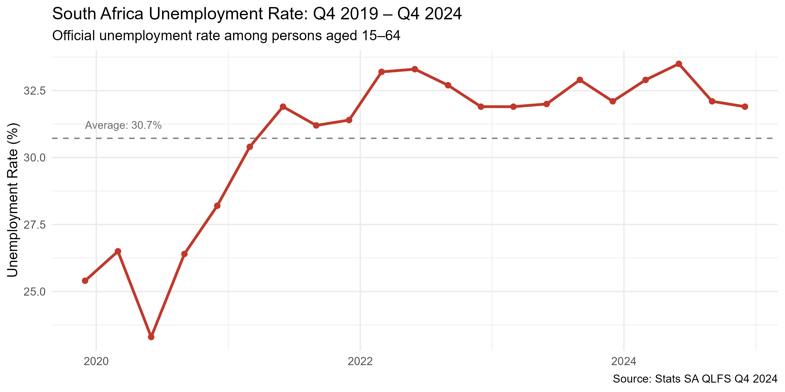
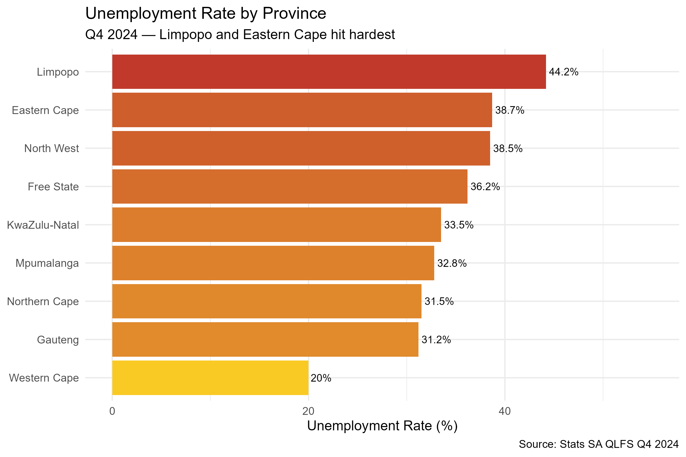
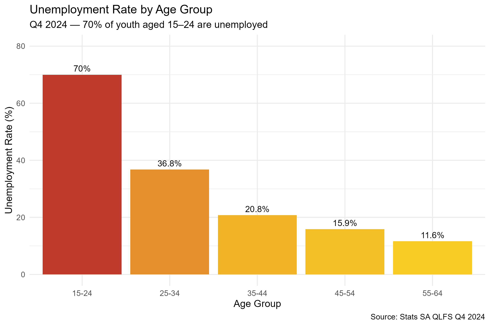
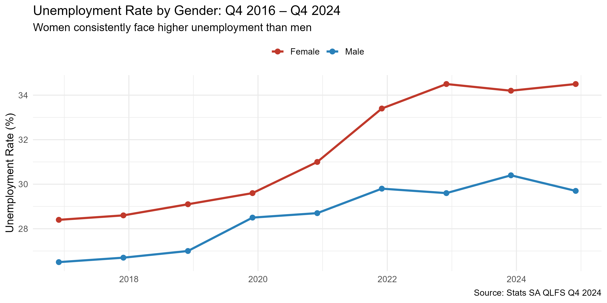

# South African Unemployment Analysis 📊

## Overview
This project analyses South Africa's labour market using official data from 
Statistics South Africa (Stats SA) Quarterly Labour Force Survey (QLFS) Q4 2024.
It explores unemployment trends by time, province, age group, and gender.

## Key Findings
- 📈 SA's unemployment rate peaked at **33.5%** in Q2 2024
- **Limpopo** has the highest provincial unemployment rate at 44.2%
- **70% of youth aged 15–24** are unemployed the most affected group
- Women face consistently higher unemployment than men (34.5% vs 29.7%)

## Data Source
- **Source:** Statistics South Africa (Stats SA)
- **Survey:** Quarterly Labour Force Survey (QLFS) Q4 2024
- **Coverage:** Persons aged 15–64 years, Q4 2019 – Q4 2024
- **Link:** https://www.statssa.gov.za

## Project Structure
sa-unemployment-analysis/

*qlfs_by_age.csv
*qlfs_by_province.csv
*qlfs_by_sex.csv
*qlfs_key_indicators.csv
*plot1_unemployment_trend.png
*plot2_province.png
*plot3_age.png
*plot4_gender.png
*sa_unemployment_analysis.R
*README.md

## Visualisations

 1. Unemployment Rate Over Time

 2. Unemployment by Province

 3. Unemployment by Age Group

 4. Unemployment by Gender

 Tools Used
- **Language:** R
- **Libraries:** tidyverse, ggplot2
- **IDE:** RStudio

## Author
Palesa Leburu
BSc Mathematical Sciences | Honours Statistics (in progress)
[www.linkedin.com/in/PalesaLeburu2022] | [https://github.com/leburupalesa22]
